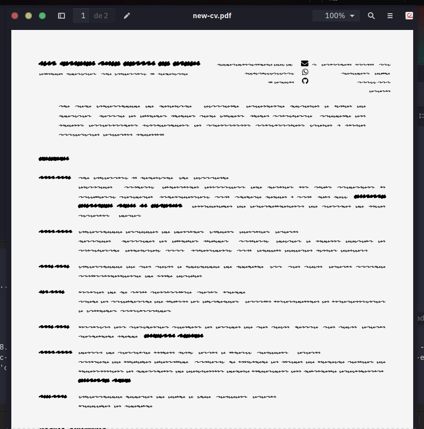

# The single plain text file Curriculum

This is an upgrade from my previous project: [Yet another pandoc markdown cv](https://github.com/lf-araujo/yapmcv). However, this time I am abandoning `make` in favor of R's Rmarkdown. There is not much to explain, except that it can be loaded into Rstudio (or simply processed with somwthing like `Rscript "rmarkdown::render(file='cv.Rmd')"` from the command line).

I recommend using `Minion Pro` font or IBM fonts; the image below shows how it looks with the `Redacted Script` font.

Also check out the pdf within the repository.

